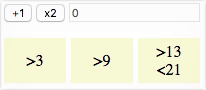
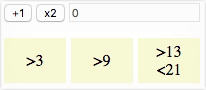
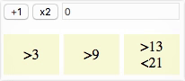
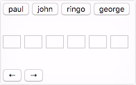
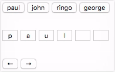
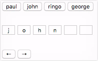
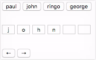
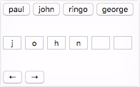

**Partiel S1 - HETIC W1 - Promotion 2020**
 Vendredi 9 février 2018 / 10h00-12h00

---

2 points sont alloués pour la lisibilité du code, le respect de l'indentation et le nommage des variables (en anglais).

Une meilleure note sera donnée à un code qui répond bien à une question plutôt qu'à un code qui répond à peu près à plusieurs questions.

## 1. Digit (9 pts)

Le fichier `digit.html` sert de base à cet exercice et doit être rendu avec le javascript complété.

a. Ajouter un écouteur d'événement `click` sur le bouton `#plus` afin qu'à chaque clic, la valeur du `input#count` soit incrémentée de 1.

**Ex.** 

b. Ajouter un écouteur d'événement `click` sur le bouton `#multiplied` afin qu'à chaque clic, la valeur du `input#count` soit multipliée par 2.

**Ex.** 

c. À chaque fois que la valeur de `input#count` est modifiée par `#plus` ou par `#multiplied`, ajouter la classe `active` au `li#greater-than-3` si cette valeur est strictement supérieure à 3. 

**Ex.** 

d. À chaque fois que la valeur de `input#count` est modifiée par `#plus` ou par `#multiplied`, ajouter la classe `active` au `li#greater-than-9` si cette valeur est strictement supérieure à 9. 

**Ex.** 

e. À chaque fois que la valeur de `input#count` est modifiée par `#plus` ou par `#multiplied`, ajouter la classe `active` au `li#between-13-and-21` si cette valeur est strictement comprise entre 13 et 21.

**Ex.** 

## 2. Letters (9 pts)

Le fichier `letters.html` sert de base à cet exercice et doit être rendu avec le javascript complété.

a. Ajouter un écouteur d'événement `click` sur le bouton `#paul` afin qu'au clic, la première lettre de son `innerHTML` ('p') soit affichée dans le premier `li > input`, la deuxième lettre ('a') soit affichée dans le second `li > input`, etc.

**Ex.** 

b. Répéter l'opération avec les boutons `#john`, `#ringo` et `#george`.

**Ex.** 

c. Ajouter un écouteur d'événement `click` sur le bouton `#move-left` afin qu'au clic, tous les caractères des `li > input` se décallent d'un input vers la gauche (le premier input reçoit la valeur du second, le second la valeur du troisème, etc).

**Ex.** 

d. Ajouter un écouteur d'événement `click` sur le bouton `#move-right` afin qu'au clic, tous les caractères des `li > input` se décallent d'un cran vers la droite (le cinquième input reçoit la valeur du quatrième, le quatrième la valeur du troisème, etc).

**Ex.** 

e. Faire en sorte que, cliquer sur le bouton `#move-left` puis cliquer sur le bouton `#move-right` restaure le caractère effacé par le décalage à gauche.

**Ex.** 