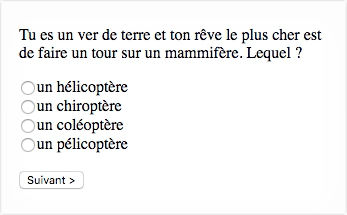
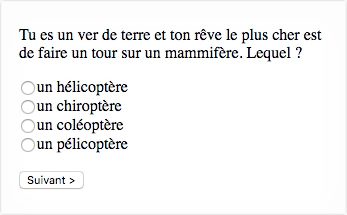
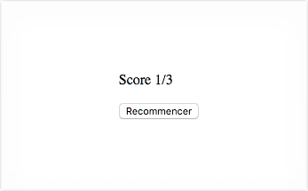
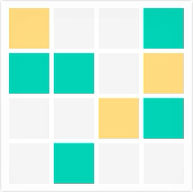
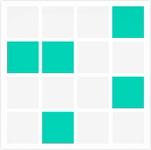

**Partiel S2 - HETIC W1 - Promotion 2020**
 Vendredi 15 juin 2018 / 10h00-12h00

---

2 points sont alloués pour la lisibilité du code, le respect de l'indentation et le nommage des variables (en anglais).

Une meilleure note sera donnée à un code qui répond bien à une question plutôt qu'à un code qui répond à peu près à plusieurs questions.

Chaque question est illustrée par un gif démontrant la fonctionnalité attendue.

## 1. Survey (9 pts)

Le fichier `survey.html` sert de base à cet exercice et doit être rendu avec le javascript complété. Une variable `survey` y déclare trois questions et, pour chacune, les réponses possibles et la réponse correcte.

a. Ajouter un écouteur d'événement `submit` sur le `form`, de façon à ce que, lorsque le bouton `.button` est cliqué, la question `.question` et les réponses `<input type="radio">` proposées soient remplacées par la question et les réponses suivantes de la variable `survey`.

**Ex.** 

b. Lorsque les trois questions ont été répondues, cliquer à nouveau sur le bouton `.button` remplace la question `.question` par un score comptabilisant le nombre de bonnes réponses sous la forme `Score 1/3` si une réponse correcte a été donnée sur les trois (par exemple).

**Ex.** 

c. Lorsque les trois questions ont été répondues, le libellé du bouton `.button` doit être `Recommencer`. Cliquer à nouveau sur ce bouton réinitialise le formulaire, et affiche la première question et les premières réponses possibles.

**Ex.** 

## 2. Square (9 pts)

Le fichier `square.html` sert de base à cet exercice et doit être rendu avec le javascript complété.

a. Ajouter un écouteur d'événement `click` sur chaque `li`, lorsqu'un premier `li` est cliqué, rien ne change à l'écran. Lorsqu'un second `li` est cliqué, les classes de ces deux `li` sont interverties. Lorsqu'un troisième `li` est cliqué, rien ne change. Lorsqu'un quatrième `li` est cliqué, les classes du troisième et du quatrième `li` sont interverties. Et ainsi de suite, les `li` sont intervertis deux par deux.

**Ex.** 

b. Faire en sorte que cliquer sur un `li` sans classe n'ai aucun effet, si il est le premier d'une paire. En d'autres termes, pour que deux `li` soient intervertis, il faut que le premier d'entre eux dispose d'une classe (`yellow` ou `turquoise`), sinon, il ne se passe rien.

**Ex.** 

c. Lorsque déplacer un `li` crée une ligne avec trois `li` de la même classe (`yellow` ou `turquoise`), les classes de ces trois `li` doivent être supprimées.

**Ex.** 

d. Lorsque déplacer un `li` crée une colonne avec trois `li` de la même classe (`yellow` ou `turquoise`), les classes de ces trois `li` doivent être supprimées.

**Ex.** 

e. Lorsque déplacer un `li` crée une ligne et une colonne avec trois `li` de la même classe (`yellow` ou `turquoise`), les classes de ces cinq `li` doivent être supprimées.

**Ex.** 
