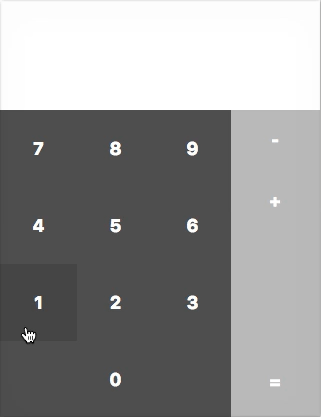
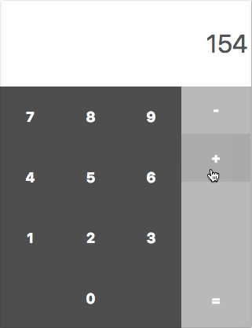
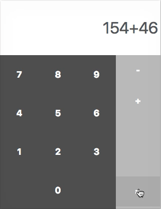
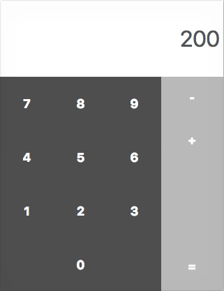
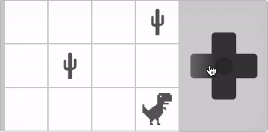
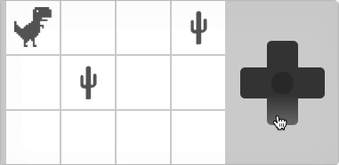

**Partiel S1 - HETIC W1 - Promotion 2021**
 Vendredi 15 février 2019 / 10h00-12h00

---

Télécharger [le correcteur automatique](https://github.com/yamsellem/hetic.js/raw/master/EXAM/{-_-}/{-_-}.zip) afin de vérifier votre code à tout moment (les instructions pour l'utiliser se trouvent dans le zip).

## 1. Calc (10 pts)

Le fichier `calc.html` sert de base à cet exercice et doit être rendu avec le javascript complété (sans modifier ni le html, ni le css).

a. Ajouter un écouteur d'événement `click` sur les dix boutons `.numeric input` afin qu'à chaque clic, leur valeur s'ajoute à la valeur affichée par `input.display`.

**Ex.** 

b. Ajouter un écouteur d'événement `click` sur les deux premiers boutons `.operation input` (le + et le -) afin qu'à chaque clic, leur signe s'ajoute à la valeur affichée par `input.display`.

**Ex.** 

c. Ajouter un écouteur d'événement `click` sur le dernier bouton `.operation input` (le =) afin qu'au clic, si un calcul est indiqué par `input.display`, ce calcul soit effectué et remplacé par son résultat.

**Ex.** 

d. Une fois un premier calcul effectué, faire en sorte qu'il soit possible de cliquer à nouveau sur un des deux opérateurs (le + ou le -), puis sur plusieurs nombres, et à nouveau sur égal. 

**Ex.** 

## 2. Dino (10 pts)

Le fichier `dino.html` sert de base à cet exercice et doit être rendu avec le javascript complété (sans modifier ni le html, ni le css).

a. Ajouter un écouteur d'événement `click` sur le bouton `.right` afin qu'à chaque clic, le dinosaure se déplace vers la droite. Une fois arrivé au dernier à droite, cela n'a plus d'effet.

**Ex.** 

b. Ajouter un écouteur d'événement `click` sur le bouton `.left` afin qu'à chaque clic, le dinosaure se déplace vers la gauche. Une fois arrivé au dernier à gauche, cela n'a plus d'effet.

**Ex.** 

c. Ajouter un écouteur d'événement `click` sur le bouton `.up` afin qu'à chaque clic, le dinosaure se déplace vers la haut. Une fois arrivé au dernier en haut, cela n'a plus d'effet.

**Ex.** 

d. Ajouter un écouteur d'événement `click` sur le bouton `.down` afin qu'à chaque clic, le dinosaure se déplace vers la bas. Une fois arrivé au dernier en bas, cela n'a plus d'effet.

**Ex.** 

e. Ajouter une condition afin qu'à chaque déplacement, le dinosaure ne puisse se retrouver sur un cactus. Appuyer sur une touche qui aurait amené le dinosaure sur un cactus n'a plus d'effet.

**Ex.** 