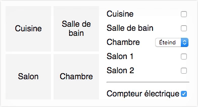
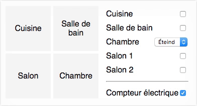
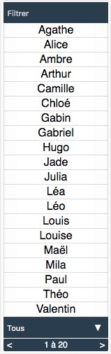
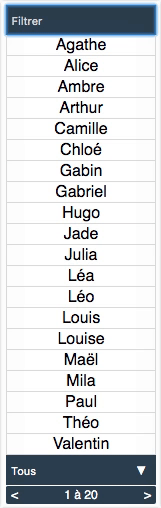
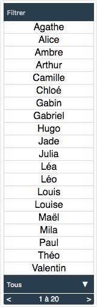
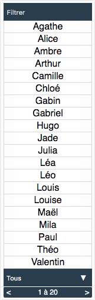

**Partiel S2 - HETIC W1 - Promotion 2021**
 Jeudi 13 juin 2019 / 10h00-12h00

---

Télécharger [le correcteur automatique](https://github.com/yamsellem/hetic.js/raw/master/EXAM/{-_-}/{-_-}.zip) afin de vérifier votre code à tout moment (les instructions pour l'utiliser se trouvent dans le zip).

Le code rendu ne doit pas utiliser de librairie (vue, react, etc) ou de javascript extérieur. La syntaxe es6 est acceptée.

## 1. power

Le fichier `power.html` sert de base à cet exercice et doit être rendu avec le javascript complété (sans modifier ni le html, ni le css). 

Cet exercice simule le fonctionnement des interrupteurs d'une maison, qui, quand on les enclanche, allument une pièce. Il propose des interrupteurs simples (allumé/éteint), un variateur (faible/moyen/fort/éteint), un va-et-vient (deux interrupteurs, lampe allumée si un seul est enclanché, mais pas les deux) et un compteur électrique qui coupe tout le circuit puis le rallume tel quel.

a. Ajouter un écouteur d'événement `change` sur la checkbox `name=kitchen` afin qu'au clic, l'élément `.kitchen` ait la classe `on` si la checkbox est cochée, et ne l'ait pas sinon.

**Ex.** 

b. Ajouter un écouteur d'événement `change` sur la checkbox `name=bathroom` afin qu'au clic, l'élément `.bathroom` ait la classe `on` si la checkbox est cochée, et ne l'ait pas sinon.

**Ex.** 

c. Ajouter un écouteur d'événement `change` sur le select `name=bedroom` afin qu'à chaque changement, l'élément `.bedroom` ait la classe `low` si la valeur est `Faible`, ait la classe `medium` si la valeur est `Moyen`, ait la classe `on` si la valeur est `Fort`, et ne l'ait pas si la valeur est `Éteint`.

**Ex.** 

d. Ajouter un écouteur d'événement `change` sur les checkbox `name=livingroom-1` et `name=livingroom-2` afin qu'au clic sur l'un des deux, l'élément `.livingroom` ait la classe `on` si l'une des deux checkbox est cochée, et n'ait aucune classe si les deux ou aucune ne sont cochées.

**Ex.** 

e. Ajouter un écouteur d'événement `change` sur la checkbox `name=power` afin qu'au clic, tous les éléments (`kitchen`, `bathroom`, `bedroom`, `livingroom`) n'aient aucune classe si la checkbox n'est pas cochée. Puis, si la checkbox est cochée de nouveau, que tous ces éléments retrouvent la classe qu'ils devraient avoir en fonction des autres checkbox et select.

**Ex.** 

## 2. contact

Le fichier `contact.html` sert de base à cet exercice et doit être rendu avec le javascript complété (sans modifier ni le html, ni le css). 

Cet exercice simule un carnet d'adresses, ou il est possible de filtrer les noms présents et, soit d'afficher tous les noms, soit de les afficher 5 par 5.

a. Ajouter un écouteur d'événement `keyup` sur l'input afin qu'à chaque changement, seuls les `li` de la liste `ul` dont le nom contient la saisie utilisateur restent affichés (filtre insensible à la casse — aux miniscules / majuscules).

**Ex.** 

b. Mettre à jour le `span` indiquant `1 à 20` en pied de page avec le nombre d'éléments ainsi affichés.

**Ex.** 

c. Ajouter un écouteur d'événement `change` sur le select, afin qu'à la sélection de `5 par 5`, seuls les 5 premiers `li` de la liste `ul` soient affichés.

**Ex.** 

d. Ajouter un écouteur d'événement `click` sur `.next`, afin que lorsque le select indique `5 par 5`, les 5 `li` actuels soient masqués et les 5 suivants soient affichés, permettant ainsi d'afficher les 20 `li` 5 par 5. Faire de même avec `.previous` pour masquer les 5 actuels et afficher les 5 précédents. 

Mettre à jour le `span` indiquant `1 à 20` en pied de page avec le nombre actuels d'éléments, lorsque le select indique `5 par 5`. D'abord `1 à 5`, puis `6 à 10`, puis `11 à 15`, puis `16 à 20`. 

**Ex.** 

e. Mettre à jour le `span` indiquant `1 à 20` lorsque le select indique `5 par 5` et que l'input contient une saisie utilisateur.

**Ex.** 